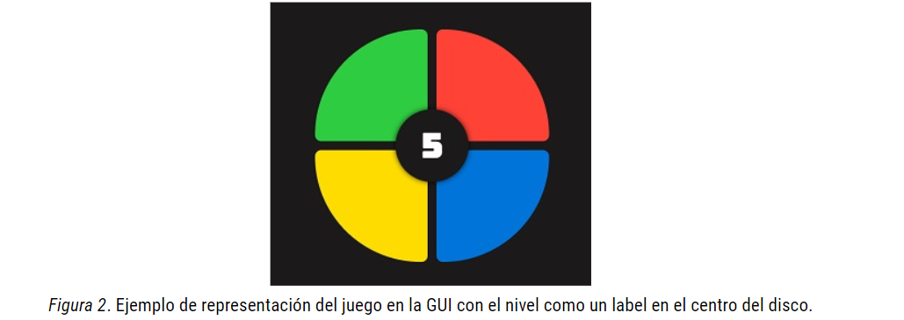

Instituto Tecnológico de Costa Rica   
Área de Ingeniería en Computadores   
Algoritmos y Estructuras de Datos I (CE 1103)   
Primer Semestre 2021

#Tarea Corta

**OBJETIVO GENERAL**    
➔Aplicar conceptos relacionados con programación orientadaa objetos y listas en Java.

**OBJETIVOS ESPECÍFICOS**    
➔Diseñar una solución a un problema mediante el usodel paradigma orientado a objetos.    
➔Aplicar conceptos de planificación Agile

**Descripción del problema**   
SimonTec es un juego de memoria que consiste en un círculo compuesto de cuatro cuadrantes, cada uno con un color: verde, rojo, azul y amarillo (ver Figura 1). El juego de forma aleatoria va iluminándolos cuadrantes de colores. Después de esperar, el usuario debe ir introduciendo la secuencia mostrada en el orden correcto. Si lo consigue, este responderá con una secuencia más larga, y así sucesivamente. Si falla, perderá el juego y deberá empezar de nuevo.

La cantidad de color es en una secuencia dependerá del nivel en el que esté. El patrón de colores se debe generar aleatoriamente y se debe ir almacenando en una estructura de datos para que conforme avancen los niveles se recuerde la secuencia anteriory solamente se añada 1 color nuevo. Por ejemplo:   
-Nivel 1: Amarillo   
-Nivel 2: Amarillo,Verde   
-Nivel 3: Amarillo, Verde,Rojo   
-Nivel 4: Amarillo, Verde, Rojo,Verde

Los distintos niveles de dificultad van aumentando la velocidad de la secuencia a repetir. Para la interfaz gráfica sencilla,puede usar JavaFX o Swing. Debe aparecer el disco y el nivel por el que va el jugador (ver Figura 2 como ejemplo).

**Historias de Usuario**

