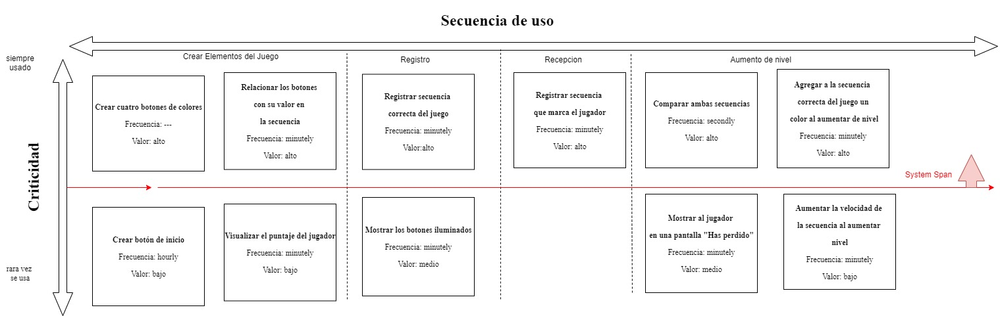
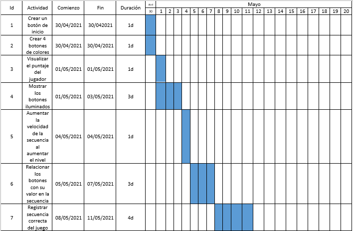

Tarea Corta   
Instituto Tecnológico de Costa Rica   
Área de Ingeniería en Computadores   
Algoritmos y Estructuras de Datos I (CE 1103)   
Primer Semestre 2021

**OBJETIVO GENERAL**    
➔Aplicar conceptos relacionados con programación orientadaa objetos y listas en Java.

**OBJETIVOS ESPECÍFICOS**    
➔Diseñar una solución a un problema mediante el usodel paradigma orientado a objetos.    
➔Aplicar conceptos de planificación Agile

**Descripción del problema**   
SimonTec es un juego de memoria que consiste en un círculo compuesto de cuatro cuadrantes, cada uno con un color: verde, rojo, azul y amarillo (ver Figura 1). El juego de forma aleatoria va iluminándolos cuadrantes de colores. Después de esperar, el usuario debe ir introduciendo la secuencia mostrada en el orden correcto. Si lo consigue, este responderá con una secuencia más larga, y así sucesivamente. Si falla, perderá el juego y deberá empezar de nuevo.

La cantidad de color es en una secuencia dependerá del nivel en el que esté. El patrón de colores se debe generar aleatoriamente y se debe ir almacenando en una estructura de datos para que conforme avancen los niveles se recuerde la secuencia anteriory solamente se añada 1 color nuevo. Por ejemplo:   
-Nivel 1: Amarillo.  
-Nivel 2: Amarillo, Verde.  
-Nivel 3: Amarillo, Verde, Rojo.
-Nivel 4: Amarillo, Verde, Rojo, Verde.

Los distintos niveles de dificultad van aumentando la velocidad de la secuencia a repetir. Para la interfaz gráfica sencilla,puede usar JavaFX o Swing. Debe aparecer el disco y el nivel por el que va el jugador (ver Figura 2 como ejemplo).

Historias de Usuario
--

--> **Crear botón de inicio**: este dará a inicio a la secuencia.    
--> **Crear 4 botones de colores**: cada color será un botón.    
--> **Visualizar el puntaje del jugador**: en el centro del juego (alrededor estarán los cuatro botones de colores), debe aparecer el puntaje que ha obtenido el jugador. Iniciando con un 0. Cada vez que el jugador acierta en la secuencia aumentará el puntaje 1 punto. Este puntaje puede ser visto también como el nivel, y la cantidad de elementos en la secuencia de colores.    
--> **Mostrar los botones iluminados**: esto será cuando se le presente la secuencia al jugador o cuando el jugador presione un botón de color.   
--> **Aumentar la velocidad de la secuencia al aumentar nivel**: cada vez que se aumente de nivel se aumentara la velocidad con la que se muestra la secuencia de colores.   
--> **Relacionar los botones con su valor en la secuencia**: cada vez que se toca un botón de color este será respectivo al color seleccionado, no ocurrirán casos donde se oprima el botón rojo y se registre en la secuencia que se marcó azul por ejemplo.    
--> **Registrar secuencia correcta del juego**: la secuencia correcta del juego es aquella que el jugador debe memorizar y presionar los botones acorde.  
--> **Agregar a la secuencia correcta del juego un color al aumentar de nivel**: si el jugador pasa de nivel entonces en el próximo nivel se agregará a la secuencia un color random a dicha secuencia.   
--> **Registrar secuencia que marca el jugador**: registrar los botones que el jugador oprime.
--> **Comparar ambas secuencias**: verificar que la secuencia que el jugador marco es igual a la secuencia correcta del juego, en caso que si sea igual aumentará de nivel y en caso que no sea igual le notificará al jugador que ha perdido.   
--> **Mostrar al jugador en una pantalla "Has perdido"**: en caso de que desacierta en la secuencia de colores se le mostrará esta pantalla con el puntaje obtenido.   
   
Clasificación según criticidad y secuencia de uso/Minimal System Span
--

Plan de iteraciones
--

Diagrama conceptual
--

Diagrama de clases
--

